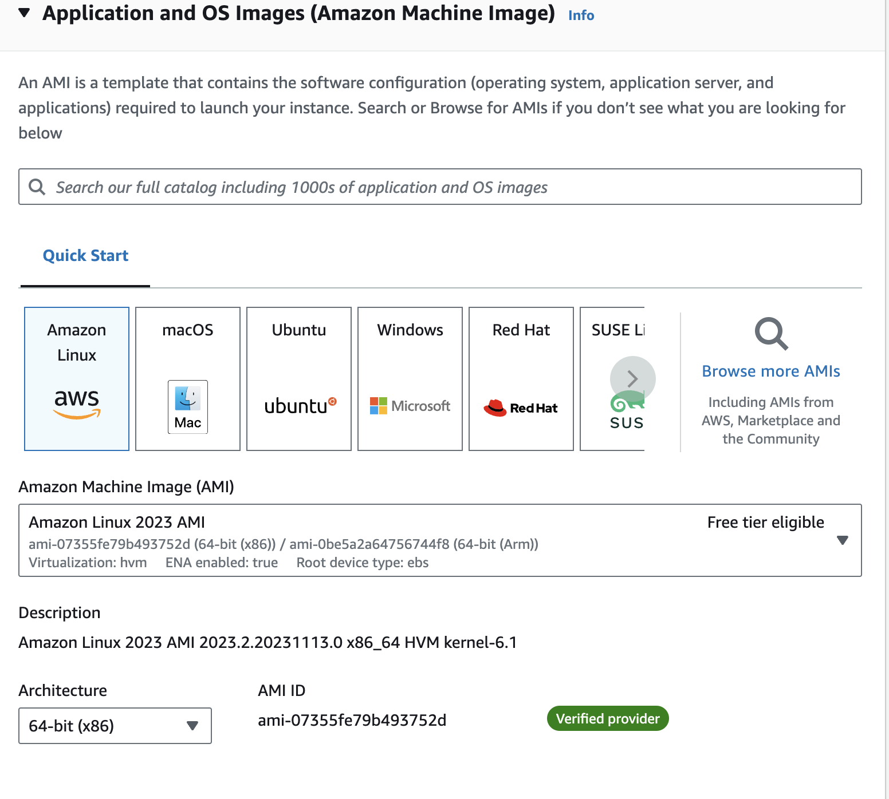
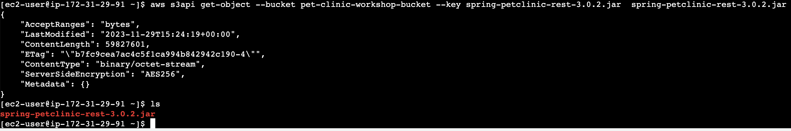

# Agenda

1. Vorstellung
2. Ziele des Workshops
3. Voraussetzungen
4. Aufstellungsarbeit (Wie gut kennen Sie sich mit Cloud Computing aus?)
5. Vorstellung des Szenarios
6. Welche Möglichkeiten gibt es die App in die Cloud zu bringen?
    - Re-Host
    - Re-Platform
    - Re-Architect
7. Demo of Quick and Dirty Re-Host (AWS Console)
8. Infrastructure as Code (User Data vs. Cloudformation vs. CDK)
9. Demo of Re-Platform with CDK
10. Kurzübersicht Re-architekt

# Vorstellung


# Ziele des Workshops

- Erste (gerne auch praktische) Erfahrung im Umgang mit AWS vermitteln
- Aufzeigen, welche Möglichkeiten man hat, um Applikationen zu migrieren und, dass es nicht so schwierig sein muss
- Dabei die häufigsten Standard-Services von AWS zeigen
- Aufzeigen, welche Fallstricke es gibt und wie man diese umgeht

> **:warning: Trotz der praktischen Relevanz unseres Beispiels, arbeiten wir natürlich mit Vereinfachungen und klammern
einige Themen,wie Beispielsweise Authentifikation und Autorisierung, bewusst aus! Wo dies relevant ist, versuche ich
immer darauf hinzuweisen.**

# Vorrausetzungen

- Grundverständnis von Programmierung und Fähigkeit Code zu lesen
- Idee wie Web Applikationen aufgebaut sind
- IDE einer Wahl (Empfehlung IntelliJ oder VSCode)
- git
- Java (bspw. openjdk)
- Maven
- node & npm
- [aws cli](https://docs.aws.amazon.com/de_de/cli/latest/userguide/getting-started-install.html) 
- angular-cli (via npm)
- aws cdk (via npm)

```shell
npm install -g aws-cdk
npm install -g @angular/cli@latest

git clone https://github.com/HopfTorsten/petclinic-to-cloud-workshop.git
```

# Aufstellungsarbeit

Stellen Sie sich bitte im Raum basierend auf der folgenden Fragestellung auf:


**Welche Erwartungen haben Sie an den Workshop?**

# Vorstellung des Szenarios

Bei der Spring Pet Clinic handelt es sich um eine Beispielapplikation, die die Features von Spring Boot zeigen soll.
Das originale kanonische Original der Anwendung finden Sie [hier](https://github.com/spring-projects/spring-petclinic).
Im Frontend wird Thymeleaf verwendet.

Innerhalb dieses Workshops benutzen wir stattdessen die beiden Projekte

- Spring Pet Clinic Rest [link](https://github.com/spring-petclinic/spring-petclinic-rest)
- Spring Pet Clinic Angular [link](https://github.com/spring-petclinic/spring-petclinic-angular)

Diese beiden Projekte sind so interessant, weil sie einen in der Branche sehr verbreiteten Tech-Stack abbilden und
vereinen.
Zusammen bilden die beiden Apps eine typische Three-Tier-Architecture:


Das Frontend bildet eine Angular App, welche wir lokal auf dem Entwicklungs-Server ausführen können, um diese auf
unserer lokalen Maschine zu testen. Diese kommuniziert über REST Schnittstellen mit unserem Backend, welches als Spring
Boot App bereit gestellt wird.

## Über das Backend

Das Besondere an Spring Boot ist, dass es den Application Server (bspw. TomCat) mit der
Applikation ausliefert und dadurch ein sogenanntes *fat jar* bildet. Dadurch ist das fertig gebaute Bundle deutlich
größer, besitzt aber keine weiteren Abhängigkeiten, um ausgeführt zu werden. Zusätzlich vereinfacht Spring Boot das
Bootstrapping einer Applikation ungemein, indem es viele Konfigurationen auf Grundlage von Annahmen vornehmen bzw.
vereinfachen und abstrahieren kann. Dies nennt man *Opinionated Defaults Configuration*. In diesem besonderen Fall ist
über die Spring Konfiguration auch eine in-memory relationale Datenbank teil der Konfiguration. Dies wird häufig zum
Testen von Applikationen -insbesondere für Integrationstests- genutzt.

### Über Spring Konfigurationen

Diese Konfigurationen kann man über die *application.properties* Datei vornehmen und anpassen. Beispiele für solche
Anpassungen sind beispielsweise der Port auf dem die Anwendung lauschen soll, das Log-Level bestimmter packages oder der
Kontext-Pfad hinter dem sich die API befindet. Zusätzlich können hier weitere Profile aktiviert oder deaktiviert werden,
über die weitere oder überschreibende Konfigurationen geladen werden.

**application.properties**

```properties
spring.profiles.active=hsqldb,spring-data-jpa
server.port=9966
server.servlet.context-path=/petclinic/
spring.messages.basename=messages/messages
spring.jpa.open-in-view=false
logging.level.org.springframework=INFO
```

Für die Profile erlaubt die Autodiscovery Datei-Schemata der Form application-{profile}.properties:

**application-hsqldb.properties**

```properties
spring.sql.init.schema-locations=classpath*:db/hsqldb/initDB.sql
spring.sql.init.data-locations=classpath*:db/hsqldb/populateDB.sql
spring.datasource.url=jdbc:hsqldb:mem:petclinic
spring.datasource.username=sa 
spring.datasource.password=
spring.jpa.database=HSQL
spring.jpa.database-platform=org.hibernate.dialect.HSQLDialect
spring.jpa.hibernate.ddl-auto=none
```

Dass die Datenbank im in-memory Modus durch die Applikation gestartet wird liegt hierbei daran, dass die URL der JDBC
Verbindung ein *mem* enthält. Dabei handelt es sich um ein Feature von HSQLDB.

### Die REST-API

Die Web-API dann einfach über Annotations implementiert:

```java
@RequestMapping(
        method = RequestMethod.GET,
        value = "/pets/{petId}",
        produces = {"application/json"}
)
default ResponseEntity<PetDto> getPet(
@Min(0) @Parameter(name = "petId", description = "The ID of the pet.", required = true, in = ParameterIn.PATH) @PathVariable("petId") Integer petId
        ){
        [...]
        return new ResponseEntity<>(HttpStatus.NOT_IMPLEMENTED);

        }
```

Sämtliche Generierung der Schnittstellen und Connection handling werden uns durch das Framework abgenommen.

### Das Datenbankschema


### Wie man den Code ausführt

Ausgeführt werden kann die Backend-Applikation sehr einfach über

```shell
cd code/spring-petclinic-rest-master
./mvnw spring-boot:run
```

Falls Sie einen Fehler bekommen, dass die Maven Wrapper Klasse nicht gefunden werden kann, müssen Sie den Wrapepr erst
durch folgenden Befehl konfigurieren:

```shell
mvn -N io.takari:maven:wrapper
```

Nun sollten Sie log Nachrichten wie die folgenden sehen:

```
 INFO  EndpointLinksResolver - Exposing 1 endpoint(s) beneath base path '/actuator'
 INFO  Http11NioProtocol - Starting ProtocolHandler ["http-nio-9966"]
 INFO  TomcatWebServer - Tomcat started on port(s): 9966 (http) with context path '/petclinic'
 INFO  PetClinicApplication - Started PetClinicApplication in 2.163 seconds (process running for 2.34)
```

Wie dem Logging zu entnehmen sollte man die Applikation nun
unter [http://localhost:9966/petclinic/](http://localhost:9966/petclinic/) erreichen können.

Hier sollte nun eine interaktive Swagger Oberfläche zu sehen sein:


Hier können Sie nun zum Beispiel alle Tierarten auflisten lassen und den ausgeführten *curl* samt Antwort (Header +
Body) sehen. Alternativ können Sie natürlich auch einfach direkt den curl über die Kommandozeile ausführen.

```shell
curl -X 'GET' \
  'http://localhost:9966/petclinic/api/pettypes' \
  -H 'accept: application/json'
```

in beiden Fällen sollten Sie nun eine Antwort wie die folgende erhalten:

```json
[
  {
    "name": "cat",
    "id": 1
  },
  {
    "name": "dog",
    "id": 2
  },
  {
    "name": "lizard",
    "id": 3
  },
  {
    "name": "snake",
    "id": 4
  },
  {
    "name": "bird",
    "id": 5
  },
  {
    "name": "hamster",
    "id": 6
  }
]
```

**Herzlichen Glückwunsch, das Backend läuft nun erfolgreich auf localhost!**

## Die Frontend-Applikation

Vom Stammverzeichnis wechseln wir nun in das Angular Project und installieren auch hier alle Abhängigkeiten:

```shell
#change folder
cd spring-petclinic-angular-master
#install dependencies
npm install
#run application in dev mode
ng serve
```

Wenn alles korrekt konfiguriert war, sollten Sie nun die folgende Meldung in der Kommandozeile bekommen:

```text
✔ Browser application bundle generation complete.

Initial Chunk Files   | Names         |  Raw Size
vendor.js             | vendor        |   4.78 MB | 
styles.css, styles.js | styles        | 570.87 kB | 
scripts.js            | scripts       | 410.93 kB | 
main.js               | main          | 352.13 kB | 
polyfills.js          | polyfills     | 335.97 kB | 
runtime.js            | runtime       |   8.38 kB | 

                      | Initial Total |   6.42 MB

Build at: 2023-11-29T13:02:33.376Z - Hash: 820af971784a945b - Time: 8610ms

** Angular Live Development Server is listening on localhost:4200, open your browser on http://localhost:4200/ **


✔ Compiled successfully.
```

Unter [http://localhost:4200](http://localhost:4200) sollte nun die folgende Seite (mit süßen Haustieren) zu sehen sein:


Die Oberflächen entsprechen mehr oder weniger 1:1 den Tabellen in der Datenbank. Der folgende Screenshot zeigt die
Owner-Seite in der auch die Haustiere und deren Besuche beim Tierarzt gezeigt werden.


Wenn Sie diese Seite so nun auch sehen können, läuft die Frontend-Anwendung nun erfolgreich bei Ihnen.

**Herzlichen Glückwunsch, Sie sind nun auch ein Frontend-Entwickler**

# Welche Möglichkeiten gibt es die App in die Cloud zu bringen?

Ein beliebtes Modell, um die Applikationen in einem Unternehmen in die Cloud zu migrieren, ist das 6-R-Modell. Dieses
vereinfacht und gliedert die vielen Möglichkeiten in sechs Migrationsvorgehen, welche leicht verständlich sind.

- Rehosting (Lift-and-shift)
- Replatforming
- Repuchasing
- Refactoring / Rearchitecting
- Retire
- Retain

**Rehosting** oder auch Lift-and-Shift (was nicht mit R anfängt) bedeutet im Wesentlichen, dass ich die Applikation in
die
Cloud verschiebe, diese es aber gar nicht merkt, weil ich einfach nur ihre lokale Hardware und Infrastrukturkomponenten
in der Cloud nachbaue. Dies ist oft der schnellste Ansatz eine Applikation in die Cloud zu bringen und wird oft als
Startpunkt genutzt, da es laut Studien und Umfragen den Entwicklern leichter fällt, die App weiterzuentwickeln, wenn
diese bereits in der Cloud ist. Gleichzeitig ist dies vom Nutzungsgrad und Infrastruktur Preis-pro-App selten die
effizienteste Variante.

Beim **Replatforming** werden bisherige Infrastrukturkomponenten durch (fully managed) Komponenten aus dem
Servicekatalog
des Cloud anbieters ersetzt. Dadurch können deutliche Einsparungen an Lizenz- und Wartungskosten entstehen. Allerdings
werden wir diesen Ansatz selten ohne Änderungen am Code umsetzen können. Gleichzeitig werden diese nicht mit einer
Neuimplementierung zu vergleichen sein. Entsprechend bilden Replatforming oft den Mittelweg für ein beginnendes
Migrationsvorhaben.

Beim **Repurchase** geht es darum bestehende (Nischen-)Produkte durch verwaltete Mainstream-Lösungen zu ersetzen und so
den
allgemeinen Verwaltungsaufwand zu reduzieren. Ein Beispiel wäre das Ersetzen der Custom CMS Komponente, die der
Werksstudent in 2011 entwickelt hat durch eine Lösung wie Salesforce. Diese Lösung ist für diesen Workshop allerdings
nicht relevant, da wir hier nicht selbst zur Tat schreiten können.

Das **Rearchitecting** einer Applikation bedeutet, dass wir sie komplett neu Betrachten und uns Fragen, wie wir die
Applikation mit dem heutigen Wissen und den heutigen Möglichkeiten bauen würden. Beispielsweise einen über Zeit
gewachsenen Monolithen in einzelne Services schneiden und diese beispielsweise unter Nutzung von Serverless-Komponenten
neu entwickeln. Dieser Ansatz ist üblicherweise bei Entwicklern sehr beliebt, da hier Altlasten reduziert werden und die
neusten Features der Cloud genutzt werden können. Gleichzeitig ist hier natürlich auch der Aufwand am höchsten. Deshalb
sollten wir auf jeden Fall eine ROI-Betrachtung durchführen, da es selten Sinn macht eine Applikation, welche kaum
genutzt wird komplett neu zu entwickeln.

Bei einem Assessment der vorhandenen Applikationen kommt es in der Regel vor, dass ca. 10-20% der Applikationen gar
nicht mehr benötigt werden. Diese können entsprechend abgeschaltet und nicht migriert werden. Dieses Vorgehen ist mit
**Retire** gemeint. Dadurch werden Ressourcen frei, die anderswo eingesetzt werden können. Dabei ist es erst einmal
egal, ob
es um Hardware-, Lizenz- oder Personalkosten geht.

Leider kommt es auch immer wieder vor, dass wir Applikationen aktuell aus rechtlichen oder Know-How Gründen aktuell
nicht migrieren können. In diesem Fall wenden wir **Retain** an, was nichts anderes heißt, als dass wir die Applikation
in
ihrer bisherigen Form beibehalten. Oft ist dies allerdings nur eine vorübergehende Lösung und wir markieren diese
Anwendung, um zu einem späteren Zeitpunkt eine erneute Betrachtung durchzuführen.

In diesem Workshop werden wir uns auf die drei R

- Rehost
- Replatform
- Rearchitect
  konzentrieren.

# Demo of Quick and Dirty Lift and Shift (AWS Console)

Unser Ziel ist es, die Applikationen auf einer virtuellen Maschine, auf AWS eine EC2-Instanz zu hosten und dort die
Infrastruktur unseres Laptops nachzustellen. Dazu werden wir unsere eigene Virtual Private Cloud (VPC) also unser
privates Netzwerk in der Cloud anlegen und unsere Instanz so platzieren, dass sie sowohl das Internet erreicht, als auch
aus dem Internet erreichbar ist. Diese Konfiguration nennt sich ein *public subnet*. Die Zielarchitektur kann wie folgt
umrissen werden:


## Pet Clinic Backend

### Upload des .jar-Files

Als Erstes erstellen wir einen S3 Bucket in der AWS Console mit den Standardeinstellungen. Wichtig ist, dass wir uns den
Namen dieses Buckets merken, bzw. merken, wo wir ihn nachschauen können. Gleiches gilt für die ARN des Buckets. Die ARN
ist die eindeutige Bezeichnung unserer AWS Ressourcen. Diese Informationen brauchen wir für spätere Konfigurationen.

Als ersten Schritt werden wir das *.jar*-File, welches die ausführbare Backend-Applikation enthält in unser S3 Bucket
hochladen.


Die Datei finden Sie unter

```shell
code/spring-petclinic-rest-master/target
```

und können Sie einfach über Drag-and-Drop hochladen.

### Erstellen der EC2-Instanz (Virtuelle Maschine)

Nun wechseln wir in zum Service-Portal des EC2 Service. Dieser erlaubt uns virtuelle Maschinen in der Cloud zu starten.
Wir beginnen geradeheraus mit dem Erstellen einer neuen Instanz. Dazu klicken wir auf "Launch a new Instance".

Nun geben wir der Instanz einen Namen und behalten die Standardeinstellungen bei. Als Betriebssystem wählen wir Amazon
Linux. Dieses ist für den Free-Tier von AWS berechtigt und verursacht mit der kleinstmöglichen Instanz keinerlei kosten
in den ersten 750 Stunden. Um eine sichere Ausführung ohne Heap-Probleme zu gewährleisten empfehle ich die Verwendung
einer t2.small Instanz.




Nun müssen wir einen SSH-Key erzeugen, den wir für die Verbindung mit unserer Instanz nutzen können. Abhängig, ob sie
auf Windows arbeiten und Putty nutzen, wählen wir der entsprechenden Key-Type aus. Im Falle von Unix Systemen nutzen wir
*.pem*.
> **:warning: Diesen dürfen wir auf keinen Fall verlieren, sonst können wir auf die Instanz nicht mehr zugreifen!**


In diesem Fall lassen wir auch die meisten Einstellungen so, wie sie aktuell sind. Das heißt wir erlauben SSH-Traffic
von jeder IP und erlauben zusätzlich noch HTTP Traffic von überall. Das ist eine Einstellung, die wir **niemals** in
Produktion verwenden würden. Wir möchten normalerweise nur Traffic von dedizierten whitelisted IPs entgegennehmen.

Damit wir unser jar-File von S3 auf die Instanz laden können, müssen wir dieser Instanz das Recht geben, den S3-Service
aufzurufen. Da wir aktuell nur lesenden Zugriff brauchen, nutzen wir die vorgefertigte Policy *AmazonS3ReadOnlyAccess*.


Die Policy sieht wie folgt aus:

```json
{
  "Version": "2012-10-17",
  "Statement": [
    {
      "Effect": "Allow",
      "Action": [
        "s3:Get*",
        "s3:List*",
        "s3:Describe*",
        "s3-object-lambda:Get*",
        "s3-object-lambda:List*"
      ],
      "Resource": "*"
    }
  ]
}
```

Dies erlaubt alle lesenden S3 Aktionen auf alle S3 Buckets in diesem Account. Natürlich würden wir in einem realen
Szenario die Ressourcen auf das konkrete Bucket einschränken.

Die Assume-Policy erlaubt nur dem Service EC2 unsere neu erstellte Rolle anzunehmen:

```json
{
  "Version": "2012-10-17",
  "Statement": [
    {
      "Effect": "Allow",
      "Action": [
        "sts:AssumeRole"
      ],
      "Principal": {
        "Service": [
          "ec2.amazonaws.com"
        ]
      }
    }
  ]
}
```

In den erweiterten Details unserer EC2-Instanz können wir nun die eben erstellte Rolle auswählen.


Hat alles geklappt sehen wir auch schon folgende Meldung:


Nun können wir uns über SSH mit der Maschine verbinden. Entweder über einen ssh-Client wie *openssh* oder *PuTTy*. In
diesem Fall brauchen wir unseren zuvor generierten ssh-Key. Alternativ können wir uns auch über den Session-Manager
verbinden. Das Menü dafür finden wir hier:


Nach einer erfolgreichen Verbindung können wir nun das Terminal unserer VM sehen.


### Konfiguration der EC2-Instanz

Leider ist auf unserer EC2-Instanz noch kein Java installiert. Das ändern wir als erstes:

``` shell
sudo yum install java-17-amazon-corretto
java -version
```

Hat alles funktioniert, sollten wir folgenden Output bekommen:


Die AWS CLI ist allesdings bereits installiert. Darüber können wir mit den anderen AWS Services interagieren. Über das
Kommando

```shell
aws s3 ls
```

sollten wir unseren zuvor erstellten Bucket sehen können:


```shell
cd home/ec2-user/
aws s3api get-object --bucket YOUR-BUCKET --key spring-petclinic-rest-3.0.2.jar spring-petclinic-rest-3.0.2.jar
```

Wenn das Kommando erfolgreich ausführt wurde, zeigt der folgende Output, dass alles funktioniert hat


Nach einem erfolgreichen
> java -jar spring-petclinic-rest-3.0.2.jar

sollten wir den folgenden Output bekommen, nachdem unsere Applikation erfolgreich gestartet ist:

```shell

  .   ____          _            __ _ _
 /\\ / ___'_ __ _ _(_)_ __  __ _ \ \ \ \
( ( )\___ | '_ | '_| | '_ \/ _` | \ \ \ \
 \\/  ___)| |_)| | | | | || (_| |  ) ) ) )
  '  |____| .__|_| |_|_| |_\__, | / / / /
 =========|_|==============|___/=/_/_/_/
 :: Spring Boot ::                (v3.0.2)

INFO  PetClinicApplication - Starting PetClinicApplication v3.0.2 using Java 17.0.9 with PID 26905 (/home/ec2-user/spring-petclinic-rest-3.0.2.jar started by ec2-user in /home/ec2-user)
DEBUG PetClinicApplication - Running with Spring Boot v3.0.2, Spring v6.0.4
INFO  PetClinicApplication - The following 2 profiles are active: "hsqldb", "spring-data-jpa"
INFO  RepositoryConfigurationDelegate - Bootstrapping Spring Data JPA repositories in DEFAULT mode.
INFO  RepositoryConfigurationDelegate - Finished Spring Data repository scanning in 273 ms. Found 7 JPA repository interfaces.
INFO  TomcatWebServer - Tomcat initialized with port(s): 9966 (http)
INFO  Http11NioProtocol - Initializing ProtocolHandler ["http-nio-9966"]
INFO  StandardService - Starting service [Tomcat]
INFO  StandardEngine - Starting Servlet engine: [Apache Tomcat/10.1.5]
INFO  [/petclinic] - Initializing Spring embedded WebApplicationContext
INFO  ServletWebServerApplicationContext - Root WebApplicationContext: initialization completed in 4994 ms
INFO  HikariDataSource - HikariPool-1 - Starting...
INFO  PoolBase - HikariPool-1 - Driver does not support get/set network timeout for connections. (feature not supported)
INFO  HikariPool - HikariPool-1 - Added connection org.hsqldb.jdbc.JDBCConnection@2b4c3c29
INFO  HikariDataSource - HikariPool-1 - Start completed.
INFO  LogHelper - HHH000204: Processing PersistenceUnitInfo [name: default]
INFO  Version - HHH000412: Hibernate ORM core version 6.1.6.Final
WARN  deprecation - HHH90000021: Encountered deprecated setting [javax.persistence.sharedCache.mode], use [jakarta.persistence.sharedCache.mode] instead
INFO  SQL dialect - HHH000400: Using dialect: org.hibernate.dialect.HSQLDialect
INFO  Version - HV000001: Hibernate Validator 8.0.0.Final
INFO  JtaPlatformInitiator - HHH000490: Using JtaPlatform implementation: [org.hibernate.engine.transaction.jta.platform.internal.NoJtaPlatform]
INFO  LocalContainerEntityManagerFactoryBean - Initialized JPA EntityManagerFactory for persistence unit 'default'
WARN  UserDetailsServiceAutoConfiguration - 

Using generated security password: 8680a1d4-636e-4bee-9888-90d78ead9ccc

This generated password is for development use only. Your security configuration must be updated before running your application in production.

INFO  DefaultSecurityFilterChain - Will secure any request with [org.springframework.security.web.session.DisableEncodeUrlFilter@43c0c13a, org.springframework.security.web.context.request.async.WebAsyncManagerIntegrationFilter@731db93f, org.springframework.security.web.context.SecurityContextHolderFilter@54b44879, org.springframework.security.web.header.HeaderWriterFilter@6f986501, org.springframework.security.web.authentication.logout.LogoutFilter@3b4bd341, org.springframework.security.web.savedrequest.RequestCacheAwareFilter@29c1249a, org.springframework.security.web.servletapi.SecurityContextHolderAwareRequestFilter@2d6a0766, org.springframework.security.web.authentication.AnonymousAuthenticationFilter@67941d, org.springframework.security.web.access.ExceptionTranslationFilter@6eeb29c0, org.springframework.security.web.access.intercept.AuthorizationFilter@20820df0]
INFO  EndpointLinksResolver - Exposing 1 endpoint(s) beneath base path '/actuator'
INFO  Http11NioProtocol - Starting ProtocolHandler ["http-nio-9966"]
INFO  TomcatWebServer - Tomcat started on port(s): 9966 (http) with context path '/petclinic'
INFO  PetClinicApplication - Started PetClinicApplication in 17.637 seconds (process running for 19.214)
```

Über den Instance Explorer in EC2 können Sie nun den öffentlichen DNS Namen Ihrer Instanz sehen. Dieser ist automatisch
generiert aus der öffentlichen IP-Adresse. Wenn alles richtig konfiguriert wurde, könnt ihr nun über diese öffentliche
DNS und den Port 9966 mit dem Pfad /petclinic erreichen:


**Herzlichen Glückwunsch! Sie haben Ihre erste Cloud-Anwendung deployed!**

## Pet Clinic Frontend

Als erstes widmen wir uns unserer Angular Anwendung und komprimieren sie, damit wir sie leichter auf S3 hochladen und
anschließend auf unsere EC2 Instanz herunterladen können.

```shell

zip -vr pet-clinic-angular.zip spring-pet-clinic-angular-master/ -x "*.DS_Store"
```

Natürlich ist auch jedes andere Tool zum komprimieren völlig in Ordnung. Anschließend laden wir das Zip-File in das S3
Bucket über die Oberfläche hoch. Das funktioniert genau wie bei unserem .jar File.

Anschließend bereiten wir unsere EC2-Instanz vor, um die Angular Anwendung auf ihr ausführen zu können.

```shell
sudo yum install nodejs
sudo npm install -g @angular/cli
aws s3api get-object --bucket pet-clinic-workshop-bucket --key pet-clinic-angular.zip  pet-clinic-angular.zip
unzip pet-clinic-angular.zip
cd spring-petclinic-angular-master/
npm install
sudo ng serve --configuration=workshop --port=80 --disable-host-check --host=0.0.0.0
```

Im Browser sollten wir nun die Startseite der Pet Clinic sehen können:


Allerdings kann diese unser Backend noch nicht erreichen. Dafür müssen wir mit einem Texteditor, wie beispielsweise
*vim* die Konfiguration anpassen, wo die API zu finden ist:

> vim src/environments/environment.workshop.ts

```json
export const environment = {
  production: false,
  REST_API_URL: 'http://<YOUR EC2 DNS Name>:9966/petclinic/api/'
};
```

Der generierte DNS Name setzt sich dabei immer aus der IP zusammen. Beispielsweise:
> REST_API_URL: 'http://ec2-63-34-8-58.eu-west-1.compute.amazonaws.com:9966/petclinic/api/'

Nach einem Neustart des Servers durch das erneute Kommando mit einem & am Ende der Zeile, um die Applikation im
Hintergrund zu starten...
> sudo ng serve --configuration=workshop --port=80 --disable-host-check --host=0.0.0.0 &

können wir die Applikation nun über den Browser erreichen. Anschließend starten wir noch den Backend Service im
Hintergrund:
> java -jar java -jar spring-petclinic-rest-3.0.2.jar &

Nun können wir die Applikation in vollem Umfang verwenden:


**Herzlichen Glückwunsch, Sie haben Ihre erste Applikation in die Cloud migriert**

### Tipp für mehr Sicherheit

Natürlich durchspielen wir hier ein stark vereinfachtes Szenario, wer aber dennoch für etwas mehr Sicherheit sorgen
will, kann über https://www.whatismyip.com/ seine public IP herausfinden und diese dann in der Security Group seiner EC2
Instanz bei den Inbound Rules hinterlegen. Somit habt ihr ein IP Whitelisting durchgeführt. Dieses müssen Sie allerdings
immer dann updaten, wenn Sie eine neue Public IP zugewiesen bekommen.


# Infrastruktur als Code (IAC)

## Probleme ohne IaC

Auch wenn wir nun unseren ersten Erfolg erzielt haben und unsere Applikation in die Cloud migriert haben, gibt es ein
einige Probleme mit diesem Ansatz:

- Es gibt keinem definierten Zielzustand in dem Account gegen den wir automatisiert prüfen können
- Manuelle Änderungen anderer Kollegen können die gesamte Umgebung stören, ohne dass wir davon mitbekommen oder den
  Fehler schnell finden können
- Die Änderungen unterliegen keiner Versionskontrolle

Deshalb schauen wir uns in den folgenden Abschnitten verschiedene Varianten zur Infrastruktur als Code an.

## User Data

Ein erster Weg der Besserung ist es, wenn wir automatisiert alle Befehle, die wir händisch auf unserer EC2-Instanz
ausgeführt haben, durchführen. Für diese Anforderung gibt es innerhalb des Service ein Feature, welches genau diese
Aufgabe übernimmt. Die User Data sind eine Aneinanderreihung von Befehlen, welche bei der Konfiguration der Instanz
base64 codiert übergeben und beim Start der Instanz ausgeführt werden.

```shell
#!/bin/bash

# Update the package lists
sudo yum update -y

# Install Java
sudo yum install java-1.8.0-openjdk -y

# Install Angular CLI
sudo npm install -g @angular/cli

# Print Java and Angular CLI versions for verification
java -version
ng --version

```

Diese User Data stellen einen ersten Schritt zum Automatisieren der Deployments dar und können im Source Code
versioniert werden. Allerdings bleiben wesentliche Konfigurationen, wie die zu verwendende AMI, Instance Type oder
Betriebssystemkonfiguration weiterhin ein manueller Aufwand.

## Cloud Formation

Ein deutlich mächtigerer Ansatz ist es, die gesamte benötigte Infrastruktur über ein IaC-Template erzeugen zu lassen.
Auf AWS gibt es dafür den Service CloudFormation, der es erlaubt verschiedene Stacks in YAML zu definieren und die dort
definierten Cloud-Ressourcen anschließend zu erzeugen. Ein vereinfachtes Beispiel für ein CloudFormation-Template ist im
folgenden gegeben:

```yaml
AWSTemplateFormatVersion: '2010-09-09'
Parameters:
  KeyName:
    Type: 'AWS::EC2::KeyPair::KeyName'
    Description: 'Name of an existing EC2 KeyPair to enable SSH access to the instance'

Resources:
  MyVPC:
    Type: 'AWS::EC2::VPC'
    Properties:
      CidrBlock: '10.0.0.0/16'

  MyInternetGateway:
    Type: 'AWS::EC2::InternetGateway'

  AttachGateway:
    Type: 'AWS::EC2::VPCGatewayAttachment'
    Properties:
      VpcId: !Ref MyVPC
      InternetGatewayId: !Ref MyInternetGateway

  MyPublicSubnet:
    Type: 'AWS::EC2::Subnet'
    Properties:
      VpcId: !Ref MyVPC
      CidrBlock: '10.0.0.0/24'
      MapPublicIpOnLaunch: true

  MyEC2Instance:
    Type: 'AWS::EC2::Instance'
    Properties:
      InstanceType: 't2.small'
      KeyName: !Ref KeyName
      ImageId: 'ami-0c55b159cbfafe1f0'  # Amazon Linux 2 AMI ID
      SubnetId: !Ref MyPublicSubnet
      UserData:
        Fn::Base64: !Sub |
          #!/bin/bash
          sudo yum update -y
          sudo yum install java-1.8.0-openjdk -y
          sudo npm install -g @angular/cli
          java -version
          ng --version
```

Dieses Template erstellt zunächst eine Virtual Private Cloud mit eigenem IP-Bereich. Anschließend wird ein Internet
Gateway erstellt, welches für die Kommunikation aus dem offenen Internet verantwortlich ist und mit der VPC gekoppelt
wird. Dadurch können wir im nächsten Schritt ein Subnet erzeugen, welches durch die Verbindung mit dem Internet Gateway
als *public subnet* bezeichnet wird. Im letzten Schritt wird die EC2-Instanz mit den bekannten Parametern und den User
Data von oben definiert.

Der hier vorgestellte deklarative Ansatz erfüllt die Anforderungen an Infrastructure as Code:

- Wir können diese Templates im Source Code unserer Anwendung verwalten und sie damit der Versionierung unterziehen und
  eine kollaborative Weiterentwicklung unserer Cloud-Umgebung födern.
- Die Templates können über die CI/CD-Template ausgeführt werden.
- Es gibt ein automatisches State-Tracking über die in CloudFormation angelegten Ressourcen.

Für viele Projekte unabhängig, ob es sich um eine Greenfield oder Migration handelt, stellen CloudFormation-Templates
damit einen guten Weg dar, die Infrastruktur zu verwalten.

## Cloud Development Kit (CDK)

Die aktuellste variante die eigene Cloud Infrastruktur für AWS zu definieren stellt CDK dar. Ursprünglich wurde das
Framework in 2018 vorgestellt und seither hat sich hier viel getan. Die Grundidee ist die selbe geblieben: Wir
definieren unsere Infrastruktur in einer von zahlreichen Programmiersprachen (u.a. Python, Typescript, Java, C#) und
können dabei alle Vorteile der OOP nutzen. Dementsprechend ist es nicht nur möglich einfache konditionale Abfragen
einzubauen, sondern darüber hinaus auch mit Vererbung und co zu arbeiten sowie unsere einzelnen Bausteine zu logischen
Konstrukten zusammenzufassen.

Der Aufbau unserer App entspricht dabei immer dem folgenden Muster:


Unsere Anwendung wird repräsentiert durch eine App, welche aus mehreren Stacks besteht, welche wiederum aus
verschiedenen Konstrukten besteht, die unsere eigenen Klassen darstellen und aus mehreren CDK Konstrukten für die
einzelnen Service-Komponenten bestehen.

Das obige CloudFormation-Template würde in CDK mit Typescript wie folgt aussehen:
import * as cdk from 'aws-cdk-lib';
import * as elasticbeanstalk from 'aws-cdk-lib/aws-elasticbeanstalk';
import * as ec2 from 'aws-cdk-lib/aws-ec2';
import * as apigateway from 'aws-cdk-lib/aws-apigateway';

```typescript
import * as cdk from 'aws-cdk-lib';
import * as ec2 from 'aws-cdk-lib/aws-ec2';
import * as iam from 'aws-cdk-lib/aws-iam';

export class MyEC2InstanceStack extends cdk.Stack {
    constructor(scope: cdk.Construct, id: string, props?: cdk.StackProps) {
        super(scope, id, props);

        // Create a VPC
        const vpc = new ec2.Vpc(this, 'MyVPC', {
            cidr: '10.0.0.0/16',
        });

        // Create an EC2 instance
        const instance = new ec2.Instance(this, 'MyEC2Instance', {
            instanceType: ec2.InstanceType.of(ec2.InstanceClass.BURSTABLE2, ec2.InstanceSize.MICRO),
            machineImage: ec2.MachineImage.latestAmazonLinux(),
            vpc,
            keyName: 'YourKeyName',  // Replace with your key name
            vpcSubnets: {subnetType: ec2.SubnetType.PUBLIC},
            userData: ec2.UserData.forLinux()
                .shebang('#!/bin/bash')
                .addCommands(
                    'sudo yum update -y',
                    'sudo yum install java-1.8.0-openjdk -y',
                    'sudo npm install -g @angular/cli',
                    'java -version',
                    'ng --version'
                ),
        });
    }
}

const app = new cdk.App();
new MyEC2InstanceStack(app, 'MyEC2InstanceStack');
app.synth();

```

Der Aufruf am Ende stellt das Synthetisieren der Anwendung dar. Das bedeutet, dass unser CDK Code ausgewertet und in ein
CloudFormation-Template "kompiliert" wird.

Bevor wir das erste Mal in unseren Account deployen müssen wir ihn für ein CDK-Deployment vorbereiten über den Befehl
> cdk bootstrap

Über das Kommando
> cdk deploy

wird unser Stack / unsere gesamte Applikation samt Infrastruktur über CloudFormation in der Cloud bereitgestellt.

Über das Kommando
> cdk synth

können wir uns das "kompilierte" CloudFormation-Template ausgeben lassen.

Über das Kommando
> cdk diff

können wir uns den Unterschied zwischen dem aktuellen Codestand und dem deployten Stand anzeigen lassen.

Wichtig ist es zwischen den verschiedenen Levels der CDK-Konstrukte zu unterscheiden. Im Wesentlichen müssen wir
zwischen zwei Levels unterscheiden:

- Level 2 Konstrukte stellen einfach nur ein 1:1 Mapping zu bestehenden CloudFormation-Konstrukten dar und sind daran
  erkennbar, dass sie mit *Cfn* beginnen
- Level 3 Konstrukte sind bereits weiter von den CloudFormation-Templates abstrahierte Klassen, welche zahlreiche
  default-Konfigurationen erlauben, wie Beispielsweise die Klasse *Bucket*

# Demo Re-Platform mit CDK

## Zielbild


### Initialisieren des Projekts

Zunächst erstellen wir ein neues (leeres Projekt):

```shell
cdk init app --language typescript
```

Im Unterordner *lib* finden wir unseren ersten automatisch generierten Stack in dem wir nun unsere Konstrukte aufbauen
können:

```typescript
import * as cdk from 'aws-cdk-lib';
import {Construct} from 'constructs';

// import * as sqs from 'aws-cdk-lib/aws-sqs';

export class SpringPetClinicCdkStack extends cdk.Stack {
    constructor(scope: Construct, id: string, props?: cdk.StackProps) {
        super(scope, id, props);

        // The code that defines your stack goes here

        // example resource
        // const queue = new sqs.Queue(this, 'SpringPetClinicCdkQueue', {
        //   visibilityTimeout: cdk.Duration.seconds(300)
        // });
    }
}
```

Im Ordner *bin* finden wir unsere App:

```typescript
import 'source-map-support/register';
import * as cdk from 'aws-cdk-lib';
import {SpringPetClinicCdkStack} from '../lib/spring-pet-clinic-cdk-stack';

const app = new cdk.App();
new SpringPetClinicCdkStack(app, 'SpringPetClinicCdkStack', {
    /* If you don't specify 'env', this stack will be environment-agnostic.
     * Account/Region-dependent features and context lookups will not work,
     * but a single synthesized template can be deployed anywhere. */

    /* Uncomment the next line to specialize this stack for the AWS Account
     * and Region that are implied by the current CLI configuration. */
    // env: { account: process.env.CDK_DEFAULT_ACCOUNT, region: process.env.CDK_DEFAULT_REGION },

    /* Uncomment the next line if you know exactly what Account and Region you
     * want to deploy the stack to. */
    // env: { account: '123456789012', region: 'us-east-1' },

    /* For more information, see https://docs.aws.amazon.com/cdk/latest/guide/environments.html */
});
```

Ich würde empfehlen die Variable *env* direkt so zu konfigurieren, dass sie auf Ihren AWS Account eingestellt ist mit
der Region eu-west-1 oder eu-central-1.

### Erstellen des Elastic Beanstalk Umgebung

Wir starten damit, dass wir unsere Elastic Beanstalk Umgebung definieren. Elastic Beanstalk ist ein Service, der es
vereinfachen soll, bestehende Applikationen in die Cloud zu heben. Im Falle eines fat-jar, also einem Jar-File, dass den
eigenen Application Server mitbringt, ist das besonders einfach:

```typescript
const applicationName = "PetClinicRest-EB-App";
//Define an VPC for the EBS instances
const vpc = new ec2.Vpc(this, "PetClinicCdkVpc");

// Create an Application-Space
const app = new elasticbeanstalk.CfnApplication(this, "PetClinicRestApplication", {
    applicationName
});
// Define the application executable that should be used in the current Version deployment
const appVersionProps = new elasticbeanstalk.CfnApplicationVersion(this, "PetClinicRestAppVersion-1", {
    applicationName,
    sourceBundle: {
        s3Bucket: "pet-clinic-workshop-bucket",
        s3Key: "spring-petclinic-rest-3.0.2.jar"
    }
});
appVersionProps.addDependency(app);
```

Im ersten Schritt erstellen wir eine eigene Virtual Private Cloud für unsere Elastic Beanstalk Umgebung. Anschließend
definieren wir eine Applikation über ihren Namen. Unter dieser Applikation erfolgen nun alle anderen Konfigurationen.
Elastic Beanstalk kann mehrere Versionen einer Applikation verwalten, allerdings benötigen wir in unserem Beispiel
aktuell nur eine feste Version, um die Komplexität gering zu halten. Da die beiden Level-2-Konstrukte nur über den
Applikationsnamen verbunden sind, müssen wir dem "compiler" helfen und eine manuelle Abhängigkeit einfügen, da es sonst
beim parallelen Aufbau der Ressourcen zu einem Fehler kommt.

```typescript
// Create a Role for the instance that allows accessing other relevant service for logging, etc.
const ebInstanceRole = new iam.Role(this, "-aws-elasticbeanstalk-ec2-role", {
    assumedBy: new iam.ServicePrincipal("ec2.amazonaws.com"),
});
const managedPolicy = iam.ManagedPolicy.fromAwsManagedPolicyName('AWSElasticBeanstalkWebTier');

ebInstanceRole.addManagedPolicy(managedPolicy);

// Allow the EBS Role to access the S3 Bucket with the jar-File
const s3Bucket = s3.Bucket.fromBucketArn(this, "S3BucketArtifacts", "arn:aws:s3:::pet-clinic-workshop-bucket");
s3Bucket.grantRead(ebInstanceRole);
const profileName = "PetClinicRestCdkDemoProfile";

// Link Role and Instance
const instanceProfile = new iam.CfnInstanceProfile(this, profileName, {
    instanceProfileName: profileName,
    roles: [
        ebInstanceRole.roleName
    ]
});
```

Anschließend definieren wir eine Rolle, mit der die Instanzen ausgeführt werden. Diese regelt welche Services und
Ressourcen aus unserer Applikation erreicht werden können. In diesem Fall bedienen wir uns einer von AWS verwalteten
Rolle *AWSElasticBeanstalkWebTier*. Anschließend fügen wir der Rolle noch das Recht zu, unseren vorher erstellten S3
Bucket zu benutzen. Sie sehen also: Auch bereits bestehende Ressourcen können über ihre *arn* in den CDK Code integriert
werden. Abschließend verbinden wir die Rolle mit einem Profil, welches wir im nächsten Schritt benötigen, um eine
vollstände Launch Configuration zu erzeugen.

```typescript
// Define launch configuration and environment variables
const optionSettingProperties: elasticbeanstalk.CfnEnvironment.OptionSettingProperty[] = [
    {
        namespace: 'aws:autoscaling:launchconfiguration',
        optionName: 'InstanceType',
        value: 't3.small',
    },
    {
        namespace: 'aws:autoscaling:launchconfiguration',
        optionName: 'IamInstanceProfile',
        value: profileName
    },
    {
        namespace: 'aws:autoscaling:launchconfiguration',
        optionName: 'IamInstanceProfile',
        value: instanceProfile.attrArn,
    },
    {
        namespace: 'aws:elasticbeanstalk:application:environment',
        optionName: 'SPRING_PROFILES_ACTIVE',
        value: 'hsqldb,spring-data-jpa,cloud',
    }
];
// Define the runtime for the environment, in this case Amazon Linux 2 with Java 17
const ebs_env = new elasticbeanstalk.CfnEnvironment(this, 'Environmentm', {
    environmentName: "PetClinicRestCdkDemo-EB-Env",
    applicationName,
    solutionStackName: "64bit Amazon Linux 2 v3.6.1 running Corretto 17",
    optionSettings: optionSettingProperties,
    versionLabel: appVersionProps.ref,

});
```

Im nächsten Schritt definieren wir Parameter mit denen die Applikation ausgeführt werden soll. Beispiele für solche
Parameter sind das zu verwendende IamInstanceProfile, das wir vorher vorbereitet haben sowie sämtliche
Umgebungsvariablen. In diesem Fall speichern wir in den Umgebungsvariablen die Profile, mit denen die App ausgeführt
werden soll. Weitere hier nicht verwendete Parameter bestimmen die minimale und maximale Anzahl an Instanzen die beim
Skalieren erzeugt werden sollen.

Nun ist alles bereit, um unsere Elastic Beanstalk Umgebung bereitzustellen.

Beim Ausführen des Kommandos
> cdk deploy

Sollte eine entsprechende Meldung kommen, die uns darauf hinweist, dass wir sicherheitsrelevante Änderungen an den IAM
Rollen durchführen:

```
This deployment will make potentially sensitive changes according to your current security approval level (--require-approval broadening).
Please confirm you intend to make the following modifications:

IAM Statement Changes
┌───┬────────────────┬────────┬────────────────┬──────────────────┬───────────┐
│   │ Resource       │ Effect │ Action         │ Principal        │ Condition │
├───┼────────────────┼────────┼────────────────┼──────────────────┼───────────┤
│ + │ ${Custom::VpcR │ Allow  │ sts:AssumeRole │ Service:lambda.a │           │
│   │ estrictDefault │        │                │ mazonaws.com     │           │
│   │ SGCustomResour │        │                │                  │           │
│   │ ceProvider/Rol │        │                │                  │           │
│   │ e.Arn}         │        │                │                  │           │
├───┼────────────────┼────────┼────────────────┼──────────────────┼───────────┤
│ + │ ${-aws-elastic │ Allow  │ sts:AssumeRole │ Service:ec2.amaz │           │
│   │ beanstalk-ec2- │        │                │ onaws.com        │           │
│   │ role.Arn}      │        │                │                  │           │
├───┼────────────────┼────────┼────────────────┼──────────────────┼───────────┤
│ + │ arn:aws:ec2:eu │ Allow  │ ec2:AuthorizeS │ AWS:${Custom::Vp │           │
│   │ -west-1:170141 │        │ ecurityGroupEg │ cRestrictDefault │           │
│   │ 608993:securit │        │ ress           │ SGCustomResource │           │
│   │ y-group/${PetC │        │ ec2:AuthorizeS │ Provider/Role}   │           │
│   │ linicCdkVpc.De │        │ ecurityGroupIn │                  │           │
│   │ faultSecurityG │        │ gress          │                  │           │
│   │ roup}          │        │ ec2:RevokeSecu │                  │           │
│   │                │        │ rityGroupEgres │                  │           │
│   │                │        │ s              │                  │           │
│   │                │        │ ec2:RevokeSecu │                  │           │
│   │                │        │ rityGroupIngre │                  │           │
│   │                │        │ ss             │                  │           │
├───┼────────────────┼────────┼────────────────┼──────────────────┼───────────┤
│ + │ arn:aws:s3:::p │ Allow  │ s3:GetBucket*  │ AWS:${-aws-elast │           │
│   │ et-clinic-work │        │ s3:GetObject*  │ icbeanstalk-ec2- │           │
│   │ shop-bucket    │        │ s3:List*       │ role}            │           │
│   │ arn:aws:s3:::p │        │                │                  │           │
│   │ et-clinic-work │        │                │                  │           │
│   │ shop-bucket/*  │        │                │                  │           │
└───┴────────────────┴────────┴────────────────┴──────────────────┴───────────┘
IAM Policy Changes
┌───┬────────────────────────────────────┬────────────────────────────────────┐
│   │ Resource                           │ Managed Policy ARN                 │
├───┼────────────────────────────────────┼────────────────────────────────────┤
│ + │ ${Custom::VpcRestrictDefaultSGCust │ {"Fn::Sub":"arn:${AWS::Partition}: │
│   │ omResourceProvider/Role}           │ iam::aws:policy/service-role/AWSLa │
│   │                                    │ mbdaBasicExecutionRole"}           │
├───┼────────────────────────────────────┼────────────────────────────────────┤
│ + │ ${-aws-elasticbeanstalk-ec2-role}  │ arn:${AWS::Partition}:iam::aws:pol │
│   │                                    │ icy/AWSElasticBeanstalkWebTier     │
└───┴────────────────────────────────────┴────────────────────────────────────┘
(NOTE: There may be security-related changes not in this list. See https://github.com/aws/aws-cdk/issues/1299)

Do you wish to deploy these changes (y/n)? y
``` 

Diese können wir (in diesem Fall) gefahrlos bestätigen, da wir diese Änderungen absichtlich durchgeführt haben. Nach
einem Deployment, welches durchaus mehrere Minuten dauern kann, sehen wir, falls alles geklappt hat, folgende Meldung:


In der AWS Management Console können wir nun unter dem Service Elastic Beanstalk die wichtigsten Metriken unserer
Applikation sehen:


Über den Link können wir ebenfalls wieder unsere Swagger Übersicht erreichen:


**Herzlichen Glückwunsch, Sie haben Ihr erstes CDK Deployment durchgeführt.**

### Bereitstellen des Frontends

Bevor wir das Frontend bereitstellen, bauen wir lokal die Version, die wir in der Cloud deployen wollen. Dafür müssen
wir die URL unserer Elastic Beanstalk Umgebung als Ziel in der Umgebungsdatei *environment.cloud.ts* anpassen:

```typescript
export const environment = {
    production: false,
    REST_API_URL: 'http://petclinicrestcdkdemo-eb-env.eba-wmbzvwcv.eu-west-1.elasticbeanstalk.com/petclinic/api/'
};
```

Anschließend bauen wir eine Version unseres Frontends, in der dieser Link gesetzt ist:
> ng build --configuration=cloud

Unser Ziel ist es, das Frontend ohne Verwaltung von Server-Instanzen zu hosten und bereitzustellen. Dafür können wir den
Serverless-Stack nutzen und uns eine weitere Eigenschaft der S3 Buckets zu eigen machen. S3 Buckets unterstützen die
Möglichkeit direkt ein Webhosting zu aktivieren. Dieses Feature können wir beim Erstellen des L3-Konstrukts direkt
aktivieren:

```typescript
const hostingBucket = new s3.Bucket(this, "PetClinicCdkHostingBucket", {
    accessControl: s3.BucketAccessControl.PRIVATE,
    bucketName: "pet-clinic-cdk-demo-ui",
    autoDeleteObjects: true,
    removalPolicy: cdk.RemovalPolicy.DESTROY,
});

new s3deployment.BucketDeployment(this, "BucketDeployment", {
    destinationBucket: hostingBucket,
    sources: [s3deployment.Source.asset(path.resolve("../spring-petclinic-angular-master/dist"))]
});
```

Anschließend deployen wir unsere Frontend-Anwendung in das neue Bucket.

Damit unsere Anwender die neue Frontend Applikation erreichen können, stellen wir diese über CloudFront bereit.
CloudFront ist Content Delivery Network, dass unsere Applikation auf verschiedene AWS Rechenzentren verteilt und dort
cached, um eine möglichst schnelle Antwortzeit an alle User basierend auf ihre Location zu garantieren. Im CDK
definieren wir diese wie folgt:

```typescript
// create an origin access identity, which is allowed to read from our web hosting bucket
const originAccessIdentity = new cloudfront.OriginAccessIdentity(this, "PetClinicCdkDemoOriginAccess", {});

hostingBucket.grantRead(originAccessIdentity);

// Create the actual cloud front distribution
const distribution = new cloudfront.Distribution(this, "PetClinicCdkDemoDistribution", {
    defaultRootObject: "index.html",
    defaultBehavior: {
        origin: new cforigin.S3Origin(hostingBucket, {originAccessIdentity}),
    },
    // Angular Routing behavior
    errorResponses: [{
        httpStatus: 403,
        responseHttpStatus: 200,
        responsePagePath: "/index.html"
    },
        {
            httpStatus: 404,
            responseHttpStatus: 200,
            responsePagePath: "/index.html"
        }]
});
```

Nach einem weiteren
> cdk deploy

und einiger Wartezeit sollte unsere Anwendung deployed sein und in der Cloud bereitliegen:


Natürlich könnten wir hier auch noch weitere Anpassungen übernehmen:

- Das Bereitstellen der petclinic über ein API-Gateway, um durchgehende TLS Verbindung sicherzustellen
- Das Auslagern der in-memory DB in eine allein stehende Datenbank gehostet auf RDS
- Das Auslagern des Frontends und des Backends in eigene Konstrukte, um den Stack übersichtlicher zu halten

Um dieses Beispiel klein und verständlich zu halten, verzichte ich an dieser Stelle auf weitere Anpassungen.

Mittels CDK ist es uns schnell gelungen, unsere Applikation auf neue Platformen zu bringen und diese dadurch in
verschiedene Richtungen zu optimieren. Unsere Frontend Applikation benötigt nun keine Server mehr und wir Zahlen nur für
die tatsächlich an die Kunden ausgelieferten Bundles. Der Preis hierfür liegt auch bei mehreren Tausend Nutzern oft im
einstelligen Euro-Bereich. Im Falle des Backends haben in diesem Falle nicht komplett die virtuellen Maschinen ersetzt,
allerdings den Management-Overhead massiv reduziert. Ein alternatives Verfahren ist hier oft die Containerisierung und
ein Deployment auf Elastic Container Service (ECS) mit Fargate.

# Re-Architect

Wollen wir die Cloud Features noch effizienter ausnutzen, kommen wir in aller Regel nicht darum herum, die Applikation
noch mehr auf den Betrieb in der Cloud zu optimieren. Nachdem wir das Frontend bereits sehr kostengünstig auf S3 hosten
und über CloudFront verteilen, ist der nächste logische Schritt auch die API sowie die Datenbank auf Serverless zu
migrieren.

Für das Backend würde das beudeten, dass wir die Abfragen an die Datenbank in Lambda-Funktionen auslagern und über ein
API-Gateway bereitstellen.

Die Datenbank würden wir in diesem Szenario auf Aurora Serverless umziehen. Durch die native Unterstützung für den
postgresql-Dialekt können wir große Teile vom Datenbank-Code wiederverwenden.


